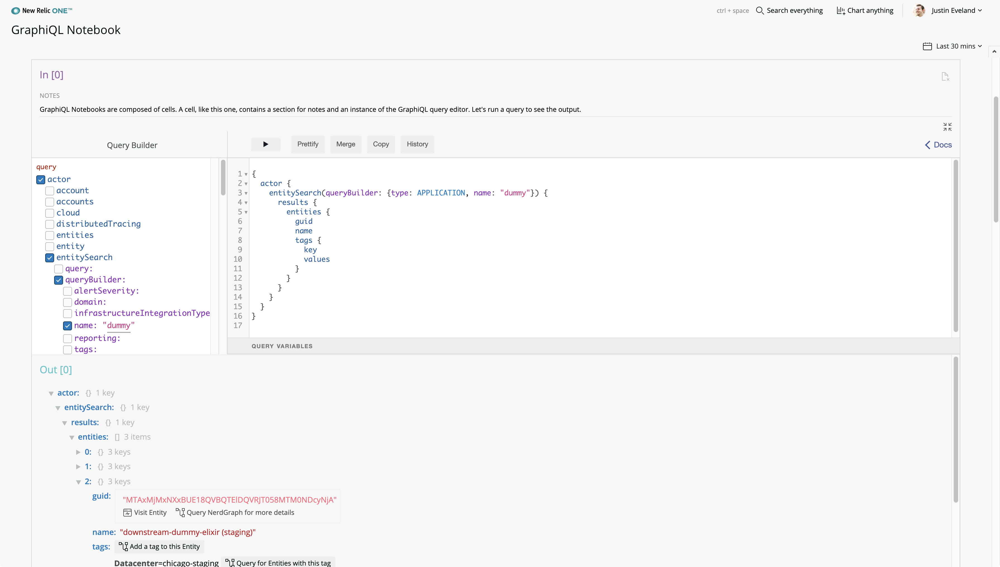
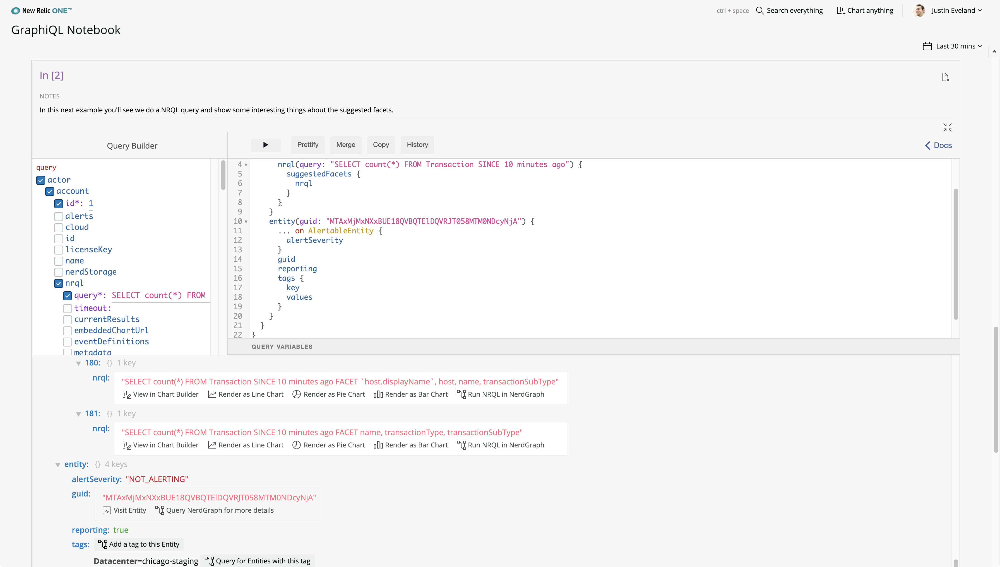

[](https://github.com/newrelic/open-source-office/blob/master/examples/categories/index.md#nr1-catalog)

# GraphiQL Notebook

  [](https://snyk.io/test/github/newrelic/nr1-graphiql-notebook)

## Usage

GraphiQL Notebook allows you to explore and learn about the [`NerdGraph API`](https://docs.newrelic.com/docs/apis/graphql-api/tutorials/nerdgraph-graphiql-entities-api-tutorial) dynamically.

Create notebooks that have context-aware, interactive elements.

Each notebook consists of cells, which each contains an independent GraphiQL instance, its own notes and rendered output.

You can create, update, save, and delete notebooks. Notebooks are exportable, and can be shared as blocks of Base64-encoded JSON.





If you're eager to jump in, see the [Quick Start](#quick-start) instructions.

## Open Source License

This project is distributed under the [Apache 2 license](./LICENSE).

## Dependencies

Requires no specific data or additional features.

## Getting started

First, ensure that you have [Git](https://git-scm.com/book/en/v2/Getting-Started-Installing-Git) and [NPM](https://www.npmjs.com/get-npm) installed. If you're unsure whether you have one or both of them installed, run the following command(s) (If you have them installed these commands will return a version number, if not, the commands won't be recognized):

```bash
git --version
npm -v
```

Next, clone this repository and run the following scripts:

```bash
nr1 nerdpack:clone -r https://github.com/newrelic/nr1-graphiql-notebook.git
cd nr1-graphiql-notebook
nr1 nerdpack:serve
```

Visit [https://one.newrelic.com/?nerdpacks=local](https://one.newrelic.com/?nerdpacks=local), navigate to the Nerdpack, and :sparkles:

### Quick Start

If you'd like a jumping-off point, click `Import Notebook` in the UI and paste in this `Getting Started` notebook:

```bash
eyJjZWxscyI6W3sicXVlcnkiOiJ7XG4gIGFjdG9yIHtcbiAgICB1c2VyIHtcbiAgICAgIGVtYWlsXG4gICAgICBuYW1lXG4gICAgfVxuICB9XG59Iiwibm90ZXMiOiJHcmFwaGlRTCBOb3RlYm9va3MgYXJlIGNvbXBvc2VkIG9mIGNlbGxzLiBBIGNlbGwsIGxpa2UgdGhpcyBvbmUsIGNvbnRhaW5zIGEgc2VjdGlvbiBmb3Igbm90ZXMgYW5kIGFuIGluc3RhbmNlIG9mIHRoZSBHcmFwaGlRTCBxdWVyeSBlZGl0b3IuIExldCdzIHJ1biBhIHF1ZXJ5IHRvIHNlZSB0aGUgb3V0cHV0LiJ9LHsicXVlcnkiOiJ7XG4gIGFjdG9yIHtcbiAgICBlbnRpdHlTZWFyY2gocXVlcnlCdWlsZGVyOiB7dHlwZTogQVBQTElDQVRJT059KSB7XG4gICAgICByZXN1bHRzIHtcbiAgICAgICAgZW50aXRpZXMge1xuICAgICAgICAgIGd1aWRcbiAgICAgICAgICBhY2NvdW50SWRcbiAgICAgICAgICBuYW1lXG4gICAgICAgICAgdGFncyB7XG4gICAgICAgICAgICBrZXlcbiAgICAgICAgICAgIHZhbHVlc1xuICAgICAgICAgIH1cbiAgICAgICAgICAuLi4gb24gQWxlcnRhYmxlRW50aXR5T3V0bGluZSB7XG4gICAgICAgICAgICBhbGVydFNldmVyaXR5XG4gICAgICAgICAgfVxuICAgICAgICB9XG4gICAgICB9XG4gICAgfVxuICB9XG59XG4iLCJub3RlcyI6IkdyYXBoaVFMIE5vdGVib29rIG91dHB1dCBpcyBcImNvbnRleHQgYXdhcmVcIi4gSXQgY29udGFpbnMgcmVuZGVyZXJzIHRoYXQgdHJ5IHRvIHNob3cgeW91IGludGVyZXN0aW5nIHRoaW5ncyBpbiB0aGUgb3V0cHV0LiBIZXJlJ3MgYW4gZXhhbXBsZSBvZiBhIHF1ZXJ5IHRoYXQgdGFrZXMgYWR2YW50YWdlIG9mIGN1c3RvbSByZW5kZXJpbmcuIn0seyJxdWVyeSI6IntcbiAgYWN0b3Ige1xuICAgIGFjY291bnQoaWQ6IDEpIHtcbiAgICAgIG5ycWwocXVlcnk6IFwiU0VMRUNUIGNvdW50KCopIEZST00gVHJhbnNhY3Rpb24gU0lOQ0UgMTAgbWludXRlcyBhZ29cIikge1xuICAgICAgICBzdWdnZXN0ZWRGYWNldHMge1xuICAgICAgICAgIG5ycWxcbiAgICAgICAgfVxuICAgICAgfVxuICAgIH1cbiAgfVxufVxuIiwibm90ZXMiOiJJbiB0aGlzIG5leHQgZXhhbXBsZSB5b3UnbGwgc2VlIHdlIGRvIGEgTlJRTCBxdWVyeSBhbmQgc2hvdyBzb21lIGludGVyZXN0aW5nIHRoaW5ncyBhYm91dCB0aGUgc3VnZ2VzdGVkIGZhY2V0cy4ifSx7InF1ZXJ5Ijoie1xuICBhY3RvciB7XG4gICAgYWNjb3VudHMge1xuICAgICAgaWRcbiAgICAgIG5hbWVcbiAgICB9XG4gIH1cbn1cbiIsIm5vdGVzIjoiVGhlc2UgcmVuZGVyZXJzIGFyZSBlYXN5IHRvIGFkZCBhbmQgY3VzdG9taXplISBDaGVjayB0aGlzIHByb2plY3QncyByZXBvIFJFQURNRSBmb3IgYSBzYW1wbGUgcmVuZGVyZXIgdGhhdCB3aWxsIHR1cm4gYWNjb3VudCBpZHMgaW50byBsaW5rcy4uLi4ifV0sInV1aWQiOiI5MTYyMDMzNS01MmYzLTQ0MjUtOTczZC1hOGVkMTY3NTFhNjUiLCJ0aXRsZSI6IkdldHRpbmcgU3RhcnRlZCJ9
```

## Deploying this Nerdpack

Open a command prompt in the nerdpack's directory and run the following commands.

```bash
# To create a new uuid for the nerdpack so that you can deploy it to your account:
# nr1 nerdpack:uuid -g [--profile=your_profile_name]

# To see a list of APIkeys / profiles available in your development environment:
# nr1 profiles:list

nr1 nerdpack:publish [--profile=your_profile_name]
nr1 nerdpack:deploy [-c [DEV|BETA|STABLE]] [--profile=your_profile_name]
nr1 nerdpack:subscribe [-c [DEV|BETA|STABLE]] [--profile=your_profile_name]
```

Visit [https://one.newrelic.com](https://one.newrelic.com), navigate to the Nerdpack, and :sparkles:

## Renderers

Context-aware rendering is made possible by a set of custom renderers that know how to render certain types or fields.

Renderers are simply React component classes with an additional static method, `test`, that accepts a node in the output and determines whether it can render that node with a custom representation. You'll find existing renderers in `nerdlets/notebook-nerdlet/renderers` (`epoch-milliseconds-renderer.js` is a friendly one).

Documentation is a little lacking at the moment but you _could_ drop your own renderer in today! Here's one you can try out that will link account IDs on account objects to the account page in APM.

Add this file to the `nerdlets/notebook-nerdlet/renderers` directory.

```javascript
import React from 'react';

// Render account IDs as links to the account page in APM
export default class AccountIdRenderer extends React.Component {
  static test(node) {
    let parent = node.__meta.parent;

    if (!parent) return false;

    let isAccountTypeObject =
      parent.__meta.typename == 'Account' ||
      parent.__meta.typename == 'AccountOutline';

    return isAccountTypeObject && node.__meta.fieldName == 'id';
  }

  render() {
    let accountId = this.props.node.value;
    return (
      <a
        target="_blank"
        href={`https://rpm.newrelic.com/accounts/${accountId}`}
      >
        Visit Account {accountId}
      </a>
    );
  }
}
```

Next, import this class into `nerdlets/notebook-nerdlet/renderers/render.js` and add it to the `RENDERERS` array.

Now send a query that includes an account ID to see your new renderer in action!

```graphql
{
  actor {
    accounts {
      name
      id
    }
  }
}
```

### About `__meta`

GraphiQL Notebook augments the response data from the GraphQL server with additional information from...

- your GraphQL query's AST
- the standard GraphQL introspection response containing schema information

This allows you to write renderers that know a lot about the data they are looking at. You can ask questions like:

- What's this fields's type?
- What's this field's parent's type?
- Does this field have any arguments with the name "guid"?
- Does this field have any ancestors anywhere that took an argument called "accountId"? What was the value of that argument?
- Is this field pointing to a list? What of?
- etc

To provide this, the response data tree is walked and the following modifications are made:

- Metadata is added to objects
- Leaf nodes (scalars) are expanded into objects so that they can contain meta data
- Lists are expanded into objects with metadata and a `values` properties linking to the original array.
- The metadata is under the key `__meta` and contains things like:
  - type name
  - leaf and list booleans
  - field name
  - a reference to the parent node
  - the path so far
  - if applicable, arguments provided to the field in the original query (for example, nrql, accountId, entity guid, etc)

The code that does this work is in `nerdlets/notebook-nerdlet/results/augmentation.js`. There are some dragons in there.

Note: metadata is omitted from the rendered results.

## Community Support

New Relic hosts and moderates an online forum where you can interact with New Relic employees as well as other customers to get help and share best practices. Like all New Relic open source community projects, there's a related topic in the New Relic Explorers Hub. You can find this project's topic/threads here:

[https://discuss.newrelic.com/t/graphiql-notebook-nerdpack/82933](https://discuss.newrelic.com/t/graphiql-notebook-nerdpack/82933)

Please do not report issues with GraphiQL Notebook to New Relic Global Technical Support. Instead, visit the [`Explorers Hub`](https://discuss.newrelic.com/c/build-on-new-relic) for troubleshooting and best-practices.

## Issues / Enhancement Requests

Issues and enhancement requests can be submitted in the [Issues tab of this repository](../../issues). Please search for and review the existing open issues before submitting a new issue.

## Contributing

Contributions are welcome (and if you submit a Enhancement Request, expect to be invited to contribute it yourself :grin:). Please review our [Contributors Guide](./CONTRIBUTING.md).

Keep in mind that when you submit your pull request, you'll need to sign the CLA via the click-through using CLA-Assistant. If you'd like to execute our corporate CLA, or if you have any questions, please drop us an email at opensource+nr1-graphiql-notebook@newrelic.com.
